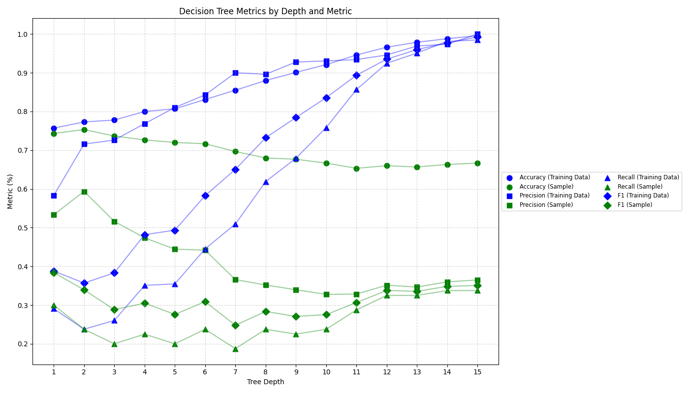

# DecisionTree

# How To:

Run generator.cpp first to generate the shopper files

Then DecisionTreeClassifier

pip install -r requirements.txt

Then run visual.py if you'd like to see a graph

## Introduction
Decision trees are a popular and highly interpretable machine learning algorithm that models a sequence of decisions in a tree-like structure. Their greatest strength lies in their white box nature, they are easy to understand, debug, and explain [1]. You can follow the decision path from root to leaf and see exactly how and why a prediction was made. They are used for medical diagnostics, loan evaluation, business marketing, finance, websites, logistics, and so much more. Decision trees are easy to understand and this makes them especially useful in domains where transparency is crucial.

This project applies a machine learning decision tree classifier to predict whether a visitor on an online site will complete a purchase. Input features include bounce rate, exit rate, page value, number of product pages, information page visits, visitor type, and if it’s on a weekend. By modeling these patterns, the tree aims to learn what kinds of sessions are more likely to convert into purchases.

The decision tree algorithm used in this project is based on CART, Classification and Regression Trees, which splits data using binary thresholds to build a tree that minimizes impurity. The implementation makes use of the Gini index although entropy is also used by others. CART was chosen for its performance, clean splits, and widespread support[2][3]. Trees of varying depths are trained on session data and tested across multiple datasets. Metrics such as accuracy, precision, recall, F1 score, and the confusion matrix are used to compare performance. The result is an easy way to see what metrics have the most impact on whether or not a purchase is made, the importance of depth in a decision tree, and how overfitting can lead to unexpcted results.

## Runtime Analysis

### Generator:
Generator has an asymptotic runtime of O(1) currently but generally has a runtime of O(n) where n is the number of sessions are wanted. It is currently O(1) as it is set to generate 1600 samples total right now, 1000 for testing, 300 for actual data, and an additional 300 for more testing. This is assuming that the distribution functions are O(1). If this is used by another program, it is O(n) as there is a for (int  = 0; i < n; ++i) loop where n is the number of sessions.

### DecisionTreeClassifier

DecisionTreeClassifier has three different asymptotic run times depending on use. If only training, the runtime is O(m\*d\*n^2) where n is the number of samples, m is the number of features, and d is the depth. Given that n is 1600, m is 7, and max tree depth is 15, technically this is O(1). Ignoring that, for buildTree each node iterates over every feature m, the values are sorted, potential splits, compute Gini O(n), which gives O(m\*n^2). This is then done for each depth which is O(m\*d\*n^2). The loading and writing take O(d\*n) time as they are in the depth loop. For using the preexisting model, it is merely traveling down a tree so the asymptotic runtime is O(d). For running the actual program, it’s O(m\*d\*n^2) since it is always learning and training off of itself.

## Results

Overall the results of the project were rather satisfactory and surprising where the Machine Learning Decision Tree Classifier had accuracies above 60% with fairly chaotic data. Originally when using the generator with little randomness, the tree depth was incredibly short, often only using 1 or 2 features and having a depth of less than 2 with incredibly high accuracy. Greater depth for the training data increased the accuracy, precision, recall, and F1 score. However, greater depth beyond 5 was often detrimental to analyzing actual data as the current system does not handle overfitting. In the future, overfitting could be fixed by going with a random tree model where things are dropped, purning the tree, feature selection, noise handling, randomly masking certain inputs, setting failsafes to stop depths once accuracy, recall, and other metrics started to go down, and so on.

## References

[1] scikit-learn, “1.10. Decision Trees — scikit-learn 0.22 documentation,” Scikit-learn.org. https://scikit-learn.org/stable/modules/tree.html

[2] “Online Shoppers Purchasing Intention Dataset,” www.kaggle.com. https://www.kaggle.com/datasets/imakash3011/online-shoppers-purchasing-intention-dataset. USed for conceptual information

[3] “ID3, C4.5, CART and Pruning,” Machine Learning Blog, Jul. 04, 2020. https://bitmask93.github.io/ml-blog/ID3-C4-5-CART-and-Pruning/
